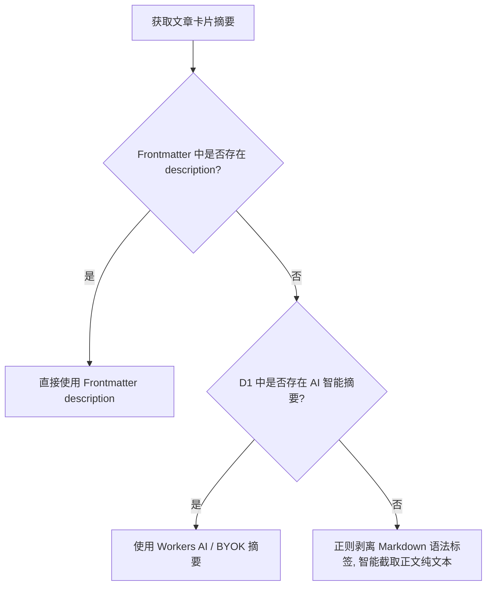

Hyacine 的设计围绕“**极致构建速度、零运行时成本、隐私至上与多端协同**”四大核心原则展开。

```
                       ┌───────────────────────────────┐
                       │   Hyacine Desktop / Console   │
                       └───────────────┬───────────────┘
                                       │ Edit & Save
                                       ▼
                       ┌───────────────────────────────┐
                       │    Cloudflare Worker (API)    │
                       ├───────────────────────────────┤
                       │  • D1 (Posts & AI Vectors)    │
                       │  • Workers AI (bge-m3/llama)  │
                       │  • KV (Summary Cache)         │
                       │  • R2 (Presigned Assets)      │
                       └───────────────┬───────────────┘
                                       │ Deploy Webhook / Build
                                       ▼
                       ┌───────────────────────────────┐
                       │  Astro SSG Build Pipeline     │
                       ├───────────────────────────────┤
                       │  hyacineLoader (@hyacine/sdk) │
                       │   ├── Batch Pull from D1      │
                       │   ├── Pre-bake Similar Graph  │
                       │   └── Astro DataStore Digest  │
                       └───────────────┬───────────────┘
                                       ▼
                       ┌───────────────────────────────┐
                       │  100% Pure Static Output      │
                       │  (Cloudflare Pages / GitHub)  │
                       └───────────────────────────────┘
```

---

## 1. D1 作为单一可信源 (Persistent Source of Truth)

在传统无头 CMS 中，要么要求博客开启 SSR（Server-Side Rendering）动态直连数据库，牺牲了 CDN 边缘缓存的极致性能并带来数据库并发压力；要么需要把所有 Markdown 推回 Git 仓库，造成庞大的 Git 提交历史。

Hyacine 创新性地结合了两者优势：

- **存储在 D1**：博文的元数据、Markdown 正文、版本哈希、AI 嵌入向量均持久化保存在 Cloudflare D1 边缘关系型数据库中。
- **构建时快照导入**：Astro 在执行 `astro build` 时，通过 `hyacineLoader` 执行一次原子抓取并载入 Astro DataStore。即使在线上修改了错别字或调整了标签，也只需触发一次 SSG 重新构建，无需污染 Git Commit 历史。

---

## 2. 构建期 AI 向量相似图预计算 (Pre-baked Similarity Graph)

许多带 AI 推荐的网站都会在浏览器端或 API 层实时计算或搜索向量数据库（如 Pinecone / Vectorize），这不仅增加了网络请求往返时间（RTT），还可能因为并发限制产生费用。

### 计算原理

在 Hyacine 的流水线中：

1. **向量生成**：文章在云端保存时，Worker 利用 Cloudflare Workers AI（`@cf/baai/bge-m3`）异步提取 1024 维 Dense 嵌入向量，持久化于 D1 数据库；
2. **构建时拉取**：`hyacineLoader` 批量获取全量文章及其向量列表；
3. **In-Memory 拓扑矩阵计算**：在 Node.js 构建内存中，计算文章两两之间的余弦相似度（Cosine Similarity）：
   $$\text{similarity}(A, B) = \frac{A \cdot B}{\|A\| \|B\|}$$
4. **Top-K 注入**：将相似度最高的前 K 篇文章作为静态属性绑定至每篇文章的 `entry.data.similarPosts` 中。
5. **静态渲染**：最终生成的 HTML 已自带相关文章链接，零客户端请求，零冷启动。

---

## 3. 三级内容摘要降级链 (Graceful Excerpt Fallback)

为了完美兼容各类 Astro 主题卡片渲染（如 `astro-blog-shokax`），Hyacine 实现了全自动的三级降级链路：



---

## 4. 隐私安全守卫 (Privacy Guard)

对于技术博客中包含的私人随笔、草稿或加密文章（标记了 `encrypted: true` 或 `password`），Hyacine 采取强隐私隔离策略：

- **云端服务拦截**：Worker API 在处理 AI 生成任务时，若检测到文章具备加密属性，将立即跳过 AI 摘要与向量生成；
- **防泄露**：确保任何私密内容都不会被传入外部大模型或公共云端推理端点。
