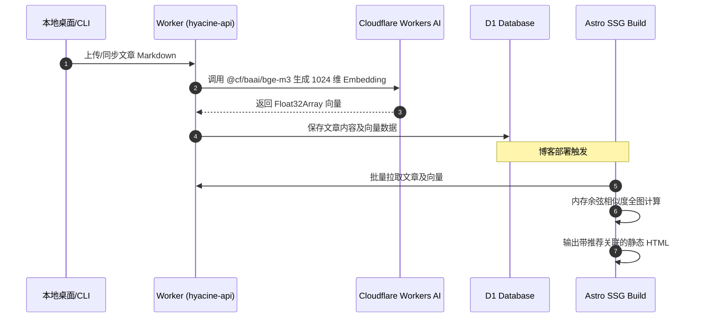

Hyacine 的向量相似度体系将 AI 运算前置到构建时，使得静态博客能够获得动态内容推荐系统的能力，而**零运行时开销、零客户端 API 密钥暴露**。

---

## 1. 向量生成工作流



---

## 2. 内存余弦相似度算法

在构建期，`@hyacine/sdk/ai` 内置了 SIMD 优化的点积与模长计算：

```ts
import { calculateSimilarityMatrix, getTopKSimilar } from "@hyacine/sdk/ai";

// 向量结构
const embeddings = [
  { slug: "post-1", vector: [...] },
  { slug: "post-2", vector: [...] },
];

// 计算全图 Top-K 矩阵
const graph = calculateSimilarityMatrix(embeddings, {
  topK: 5,
  threshold: 0.35,
});
```

---

## 3. 在主题中渲染相关文章推荐组件

在 Astro 组件中（如 `src/components/SimilarPosts.astro`）：

```astro title="src/components/SimilarPosts.astro"
---
import { getEntry } from "astro:content";

interface Props {
  similarList?: Array<{ slug: string; similarity: number }>;
}

const { similarList = [] } = Astro.props;

// 解析关联文章的完整详情
const posts = await Promise.all(
  similarList.map(async (item) => {
    const post = await getEntry("posts", item.slug);
    return post ? { ...post, similarity: item.similarity } : null;
  })
);

const validPosts = posts.filter(Boolean);
---

{validPosts.length > 0 && (
  <aside class="similar-widget">
    <h3>🔗 猜你还喜欢（AI 相似推荐）</h3>
    <div class="similar-grid">
      {validPosts.map((post) => (
        <a href={`/posts/${post.id}`} class="similar-card">
          <h4>{post.data.title}</h4>
          <span class="score">匹配度: {(post.similarity * 100).toFixed(0)}%</span>
        </a>
      ))}
    </div>
  </aside>
)}
```
