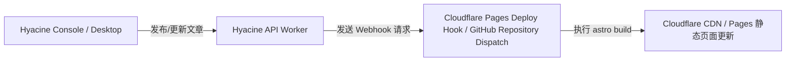

在纯静态博客架构中，当通过 Hyacine Console、Desktop 或 CLI 发布了新文章或修改了内容后，可以通过 Webhook 自动触发静态站点的重新构建。

---

## 1. 触发构建模式



---

## 2. GitHub Actions 自动构建示例

在你的博客仓库中创建 `.github/workflows/deploy.yml`：

```yaml title=".github/workflows/deploy.yml"
name: Deploy Astro Blog

on:
  push:
    branches: [main]
  repository_dispatch:
    types: [hyacine-content-update]
  workflow_dispatch:

jobs:
  build-and-deploy:
    runs-on: ubuntu-latest
    steps:
      - name: Checkout Code
        uses: actions/checkout@v4

      - name: Install pnpm
        uses: pnpm/action-setup@v4
        with:
          version: 11

      - name: Setup Node.js
        uses: actions/setup-node@v4
        with:
          node-version: 24
          cache: "pnpm"

      - name: Install Dependencies
        run: pnpm install --frozen-lockfile

      - name: Build Astro SSG
        env:
          HYACINE_API_URL: ${{ secrets.HYACINE_API_URL }}
          HYACINE_READ_TOKEN: ${{ secrets.HYACINE_READ_TOKEN }}
        run: pnpm run build

      - name: Deploy to Cloudflare Pages
        uses: cloudflare/wrangler-action@v3
        with:
          apiToken: ${{ secrets.CLOUDFLARE_API_TOKEN }}
          accountId: ${{ secrets.CLOUDFLARE_ACCOUNT_ID }}
          command: pages deploy dist --project-name=my-astro-blog
```
