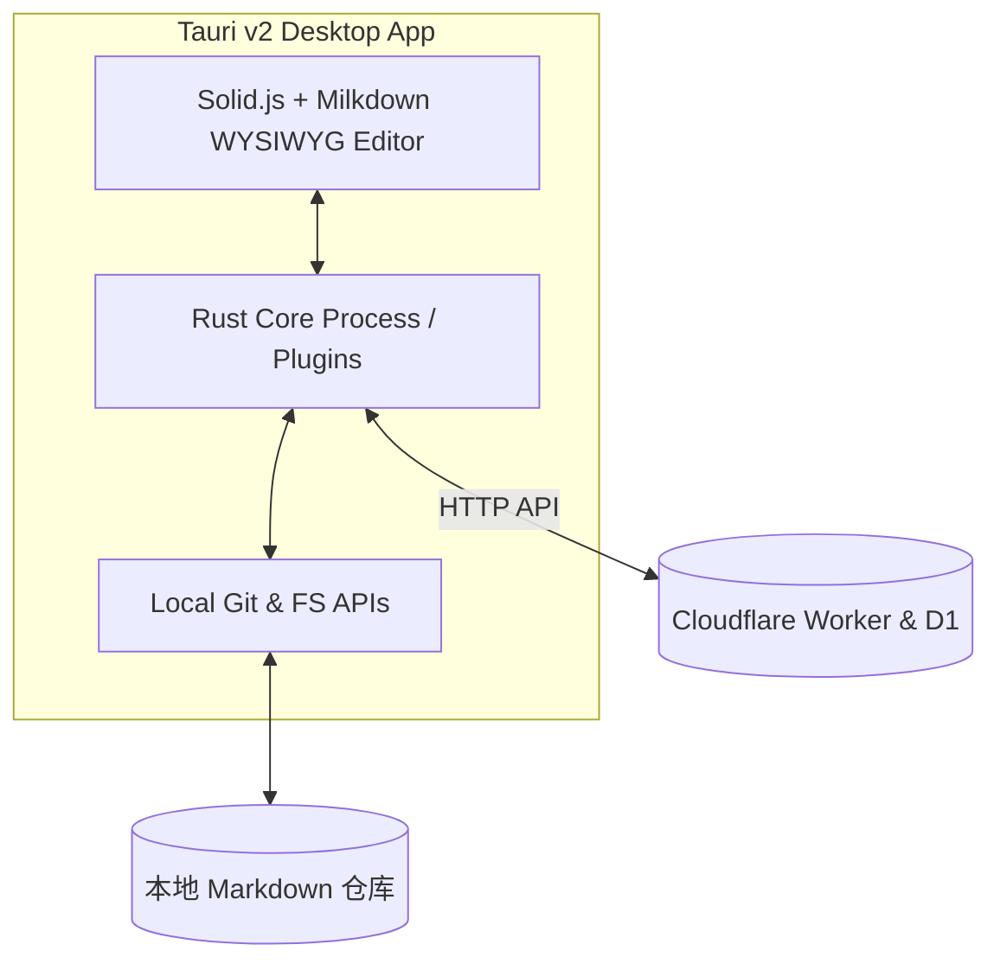

Hyacine Desktop (`apps/desktop`) 是专为博主打造的高性能桌面写作客户端。

---

## 1. 核心特性

- ⚡ **超轻量与低内存**：基于 **Tauri v2** 与 Rust 原生轻量 WebView 架构，启动毫秒级，内存占用远低于 Electron；
- 📝 **Milkdown 所见即所得编辑**：原生 Markdown / MDX 编辑器，支持数学公式 KaTeX、Mermaid 图表、代码高亮与表格即时渲染；
- 📂 **本地优先与双模工作区**：
  - 离线时可直接作为本地 Markdown 目录管理器与 Git 客户端；
  - 连网后可一键与 Cloudflare D1 增量双向同步；
- 🖼️ **资产拖拽直传**：支持将剪贴板或本地图片拖入编辑器，自动生成 R2 预签名 URL 直传或保存至本地 `src/assets` 目录。

---

## 2. 架构拓扑



---

## 3. 本地编译与运行

在开发环境中构建桌面应用：

```bash
# 进入桌面应用目录
cd apps/desktop

# 安装 Rust 依赖并以开发模式启动
pnpm run tauri dev

# 打包为生产安装包 (.msi / .dmg / .deb)
pnpm run tauri build
```
